# Table of Contents
 <p><div class="lev1 toc-item"><a href="#PyCoTools-Tutorial" data-toc-modified-id="PyCoTools-Tutorial-1"><span class="toc-item-num">1&nbsp;&nbsp;</span><strong>PyCoTools Tutorial</strong></a></div><div class="lev1 toc-item"><a href="#Installation" data-toc-modified-id="Installation-2"><span class="toc-item-num">2&nbsp;&nbsp;</span><strong>Installation</strong></a></div><div class="lev3 toc-item"><a href="#Python" data-toc-modified-id="Python-201"><span class="toc-item-num">2.0.1&nbsp;&nbsp;</span>Python</a></div><div class="lev3 toc-item"><a href="#PyCoTools" data-toc-modified-id="PyCoTools-202"><span class="toc-item-num">2.0.2&nbsp;&nbsp;</span>PyCoTools</a></div><div class="lev3 toc-item"><a href="#Pip" data-toc-modified-id="Pip-203"><span class="toc-item-num">2.0.3&nbsp;&nbsp;</span>Pip</a></div><div class="lev3 toc-item"><a href="#COPASI" data-toc-modified-id="COPASI-204"><span class="toc-item-num">2.0.4&nbsp;&nbsp;</span>COPASI</a></div><div class="lev1 toc-item"><a href="#Setting-up-a-Workspace" data-toc-modified-id="Setting-up-a-Workspace-3"><span class="toc-item-num">3&nbsp;&nbsp;</span>Setting up a Workspace</a></div><div class="lev1 toc-item"><a href="#Run-a-Time-Course" data-toc-modified-id="Run-a-Time-Course-4"><span class="toc-item-num">4&nbsp;&nbsp;</span>Run a Time Course</a></div><div class="lev2 toc-item"><a href="#Add-Noise-to-Time-Course" data-toc-modified-id="Add-Noise-to-Time-Course-41"><span class="toc-item-num">4.1&nbsp;&nbsp;</span>Add Noise to Time Course</a></div><div class="lev1 toc-item"><a href="#Parameter-Estimation" data-toc-modified-id="Parameter-Estimation-5"><span class="toc-item-num">5&nbsp;&nbsp;</span>Parameter Estimation</a></div><div class="lev2 toc-item"><a href="#Instantiate-Instance-of-ParameterEstimation" data-toc-modified-id="Instantiate-Instance-of-ParameterEstimation-51"><span class="toc-item-num">5.1&nbsp;&nbsp;</span>Instantiate Instance of ParameterEstimation</a></div><div class="lev3 toc-item"><a href="#Parameter-Estimation-with-a-Single-Experiment-File" data-toc-modified-id="Parameter-Estimation-with-a-Single-Experiment-File-511"><span class="toc-item-num">5.1.1&nbsp;&nbsp;</span>Parameter Estimation with a Single Experiment File</a></div><div class="lev3 toc-item"><a href="#Parameter-Estimation-with-Two-Experiment-Files" data-toc-modified-id="Parameter-Estimation-with-Two-Experiment-Files-512"><span class="toc-item-num">5.1.2&nbsp;&nbsp;</span>Parameter Estimation with Two Experiment Files</a></div><div class="lev3 toc-item"><a href="#Steady-State-Experiments" data-toc-modified-id="Steady-State-Experiments-513"><span class="toc-item-num">5.1.3&nbsp;&nbsp;</span>Steady State Experiments</a></div><div class="lev2 toc-item"><a href="#Create-a-Configuration-File" data-toc-modified-id="Create-a-Configuration-File-52"><span class="toc-item-num">5.2&nbsp;&nbsp;</span>Create a Configuration File</a></div><div class="lev2 toc-item"><a href="#Use-the-PE.set_up()-method" data-toc-modified-id="Use-the-PE.set_up()-method-53"><span class="toc-item-num">5.3&nbsp;&nbsp;</span>Use the <code>PE.set_up()</code> method</a></div><div class="lev2 toc-item"><a href="#Run-the-Parameter-Estimation" data-toc-modified-id="Run-the-Parameter-Estimation-54"><span class="toc-item-num">5.4&nbsp;&nbsp;</span>Run the Parameter Estimation</a></div><div class="lev3 toc-item"><a href="#Using-PE.run()" data-toc-modified-id="Using-PE.run()-541"><span class="toc-item-num">5.4.1&nbsp;&nbsp;</span>Using PE.run()</a></div><div class="lev3 toc-item"><a href="#The-Plot-kwarg" data-toc-modified-id="The-Plot-kwarg-542"><span class="toc-item-num">5.4.2&nbsp;&nbsp;</span>The <code>Plot</code> kwarg</a></div><div class="lev3 toc-item"><a href="#Running-Multiple-Parameter-Estimations" data-toc-modified-id="Running-Multiple-Parameter-Estimations-543"><span class="toc-item-num">5.4.3&nbsp;&nbsp;</span>Running Multiple Parameter Estimations</a></div><div class="lev3 toc-item"><a href="#The-Copy-and-Paste-Method" data-toc-modified-id="The-Copy-and-Paste-Method-544"><span class="toc-item-num">5.4.4&nbsp;&nbsp;</span>The Copy and Paste Method</a></div><div class="lev3 toc-item"><a href="#On-a-Cluster" data-toc-modified-id="On-a-Cluster-545"><span class="toc-item-num">5.4.5&nbsp;&nbsp;</span>On a Cluster</a></div><div class="lev1 toc-item"><a href="#Parameter-Estimation-Analysis" data-toc-modified-id="Parameter-Estimation-Analysis-6"><span class="toc-item-num">6&nbsp;&nbsp;</span>Parameter Estimation Analysis</a></div><div class="lev2 toc-item"><a href="#Parsing-Data" data-toc-modified-id="Parsing-Data-61"><span class="toc-item-num">6.1&nbsp;&nbsp;</span>Parsing Data</a></div><div class="lev2 toc-item"><a href="#Visualize-Optimization-Performance" data-toc-modified-id="Visualize-Optimization-Performance-62"><span class="toc-item-num">6.2&nbsp;&nbsp;</span>Visualize Optimization Performance</a></div><div class="lev2 toc-item"><a href="#Simulations-Versus-Experiment-Plots" data-toc-modified-id="Simulations-Versus-Experiment-Plots-63"><span class="toc-item-num">6.3&nbsp;&nbsp;</span>Simulations Versus Experiment Plots</a></div><div class="lev2 toc-item"><a href="#Boxplots" data-toc-modified-id="Boxplots-64"><span class="toc-item-num">6.4&nbsp;&nbsp;</span>Boxplots</a></div><div class="lev2 toc-item"><a href="#Histograms" data-toc-modified-id="Histograms-65"><span class="toc-item-num">6.5&nbsp;&nbsp;</span>Histograms</a></div><div class="lev2 toc-item"><a href="#Scatter-Graphs" data-toc-modified-id="Scatter-Graphs-66"><span class="toc-item-num">6.6&nbsp;&nbsp;</span>Scatter Graphs</a></div><div class="lev2 toc-item"><a href="#Hex-Maps" data-toc-modified-id="Hex-Maps-67"><span class="toc-item-num">6.7&nbsp;&nbsp;</span>Hex Maps</a></div><div class="lev1 toc-item"><a href="#Pydentify2:-Profile-Likelihoods" data-toc-modified-id="Pydentify2:-Profile-Likelihoods-7"><span class="toc-item-num">7&nbsp;&nbsp;</span><code>Pydentify2</code>: Profile Likelihoods</a></div><div class="lev2 toc-item"><a href="#Profile-Likelihoods-Around-Current-Point-in-Parameter-Space" data-toc-modified-id="Profile-Likelihoods-Around-Current-Point-in-Parameter-Space-71"><span class="toc-item-num">7.1&nbsp;&nbsp;</span>Profile Likelihoods Around Current Point in Parameter Space</a></div><div class="lev2 toc-item"><a href="#Using-the-ParameterPath-argument" data-toc-modified-id="Using-the-ParameterPath-argument-72"><span class="toc-item-num">7.2&nbsp;&nbsp;</span>Using the <code>ParameterPath</code> argument</a></div><div class="lev3 toc-item"><a href="#Integer-Index" data-toc-modified-id="Integer-Index-721"><span class="toc-item-num">7.2.1&nbsp;&nbsp;</span>Integer Index</a></div><div class="lev3 toc-item"><a href="#List-Index" data-toc-modified-id="List-Index-722"><span class="toc-item-num">7.2.2&nbsp;&nbsp;</span>List Index</a></div><div class="lev2 toc-item"><a href="#Running-Profile-Likelihood-Calculations" data-toc-modified-id="Running-Profile-Likelihood-Calculations-73"><span class="toc-item-num">7.3&nbsp;&nbsp;</span>Running Profile Likelihood Calculations</a></div><div class="lev1 toc-item"><a href="#Running-on-a-Cluster" data-toc-modified-id="Running-on-a-Cluster-8"><span class="toc-item-num">8&nbsp;&nbsp;</span>Running on a Cluster</a></div><div class="lev1 toc-item"><a href="#Scripts" data-toc-modified-id="Scripts-9"><span class="toc-item-num">9&nbsp;&nbsp;</span>Scripts</a></div><div class="lev1 toc-item"><a href="#Refernces" data-toc-modified-id="Refernces-10"><span class="toc-item-num">10&nbsp;&nbsp;</span>Refernces</a></div>

# **PyCoTools Tutorial** 

This tutorial provides a tutorial on how to simulate a COPASI model, set up, run and analyse parameter estimations and calculate profile likelihoods using COPASI and PyCoTools. For detailed information on each class and their keyword arguments (kwargs), see the technical documentation distributed with PyCoTools.  The Kholodenko2000 model is used as a show case model in this tutorial which is oridented toward demonstrating use of PyCoTools. For a second tutorial on how to use PyCoTools to estimate parameters, download the [ModelCalibrationWorkflow](https://github.com/CiaranWelsh/PyCoTools/blob/master/PyCoTools/Examples/KholodenkoExample/ModelCalibrationWorkflow.ipynb).

# **Installation**


### Python
PyCoTools was written on [Anaconda2](https://www.continuum.io/downloads) distribution of Python 2.7 and has several dependencies. It is recommended to also install the Anaconda distribution as it comes with a number of useful python packages. 

### PyCoTools

To install PyCoTools, from a command line or terminal with administrative privalleges, use:

        > pip install PyCoTools

The PyCoTools source code is also available on [GitHub](https://github.com/CiaranWelsh/PyCoTools)

### Pip 

If you don't have [pip](https://docs.python.org/3/installing/) it can be [downloaded](https://bootstrap.pypa.io/) and installed by running:
        
        > python get-pip.py 

from wherever to was downloaded it to (with administrative privalleges). Dependencies usually install with PyCoTools but if they do not run:
        
        > pip install matplotlib pandas numpy scipy argparse lxml

(again with admin rights)

### COPASI 
PyCoTools was written on COPASI version 16. Since writing PyCoTools, COPASI have changed a few things internally which affect the way it reads the XML. For this reason PyCoTools is not yet functional with the newest version of COPASI and version 16 should be installed and used. Efforts are being made to update PyCoTools to support   

# Setting up a Workspace

Since the input to most of the classes in the `pycopi` module are strings containing the path to a copasi file and a user  often requires custom output filenames (rather than the defaults), its common to have a numerous file paths to manage at any one time. One way to deal with this is to conduct your analysis from a new folder containing the .cps file of interest and any data files. Then the paths to these files can be stored in an importable python class. This helps keep track of files and folders. 

            1. Create new folder for your analysis.
            2. Create a blank `__init__.py' file in this folder
            3. Create a module called (for instance) `FilePaths.py` 
            4) Place a class inside `FilePaths` containing paths relevant to your analysis. 

Here is an example: 


```python
#FilePaths.py
class KholodenkoExample():
    def __init__(self):
        ## path to folder containing kholodenko example
        if sys.platform=='win32':
            self.current_directory='D:\MPhil\Python\My_Python_Modules\Modelling_Tools\PyCoTools\PyCoTools\Examples\KholodenkoExample'
        else:
            ## workspace on cluster
            self.current_directory=r'/sharedlustre/users/b3053674/2017/Jan/Kholod/KholodenkoExample'
        ## Kholodenko filename
        self.copasi_filename=r'Kholodenko.cps'
        ## full path to kholodenko model
        self.kholodenko_model=os.path.join(self.current_directory,self.copasi_filename)
        ## full path to the time course output
        self.timecourse_report=os.path.join(self.current_directory,'KholodenkoTimeCourseOutput.txt')
        ## full path to the noisy time course output
        self.noisy_timecourse_report=os.path.join(self.current_directory,'NoisyKholodenkoTimeCourseOutput.txt')
        ## Full path to parameter estimation results file
        self.PEData_file=os.path.join(self.current_directory,'PEResultsFile.txt')
        ## Full path to a folder containing all data from initial multiple global parameter estimations
        self.PEData_dir=os.path.join(self.current_directory,'PEResults')
        ## Full path to file containing secondary local parameter estimation (starting with best values from self.PEData_dir)
        self.local_PEData_dir=os.path.join(self.current_directory,'LocalPEDataResults')
        ## Pre-run parameter estimation data pickle file. 
        self.GlobalPEData=os.path.join(self.current_directory,'1GlobalPEData.pickle')
        self.LocalPEData=os.path.join(self.current_directory,'1LocalPEData.pickle') 
```

These paths are now available  for the rest of the `.py` files in the current directory by importing the `FilePaths` module and  instantiating an instance of `KholodenkoExample()`. 

# Run a Time Course 

The `pycopi.TimeCourse` class enables a user to run an COPASI model deterministically. Future versions of PyCoTools will implement the alternative sovlers that COPASI offers which will be accessible via a keyword argument, but presently this feature is not implemented. 

From the directory containing FilePaths.py:


```python
import PyCoTools
from FilePaths import KholodenkoExample
## allow plotting in this document
%matplotlib inline

## instantiate instance of KholodenoExample to manage directories 
K=KholodenkoExample()
```

To run deterministic time course with kholodenko model we have a few options. We can:
    1. Collect all copasi output as tab separated file specified as argument to the `ReportName` keyword.


```python
PyCoTools.pycopi.TimeCourse(K.kholodenko_model,
                        ReportName=K.timecourse_report,
                        ## Intervals*StepSize must equal End
                        End=1000,    
                        Intervals=50,
                        StepSize=20)
```


    <PyCoTools.pycopi.TimeCourse at 0x431ccc0>


    2. Collect results only for selected model variables only by passing a list to the `Metabolites` keyword. When no argument is specified, all model variables are selected by default:


```python
PyCoTools.pycopi.TimeCourse(K.kholodenko_model,
                            ReportName=K.timecourse_report,
                            End=1000,
                            Intervals=50,
                            StepSize=20,
                            Plot='false',
                            SaveFig='true',
                            Metabolites=['Mek1-P','Mek1'])
```


    <PyCoTools.pycopi.TimeCourse at 0xdc93080>


    3. Plot and save results in the same directory as the model file


```python
PyCoTools.pycopi.TimeCourse(K.kholodenko_model,
                            ReportName=K.timecourse_report,
                            End=1000,
                            Intervals=50,
                            StepSize=20,
                            Plot='true',
                            SaveFig='true')
```


    <PyCoTools.pycopi.TimeCourse at 0x10916940>


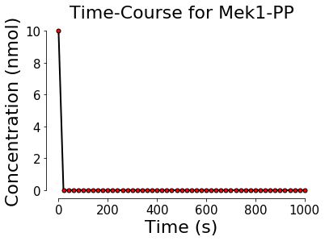


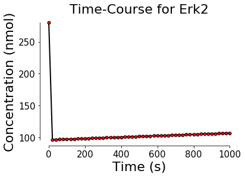


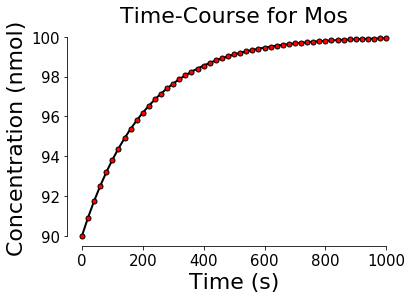


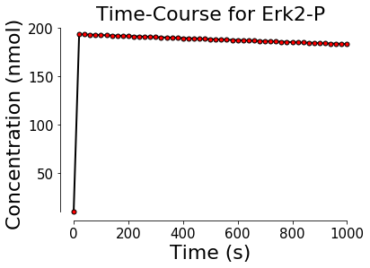


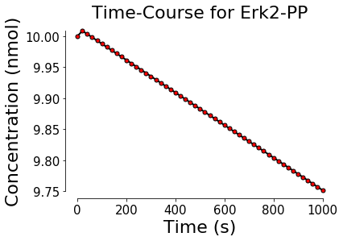


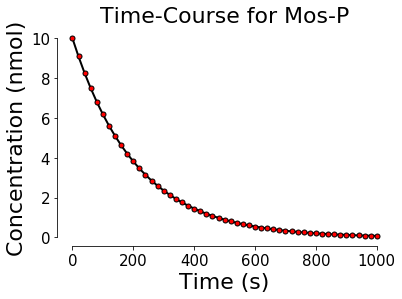


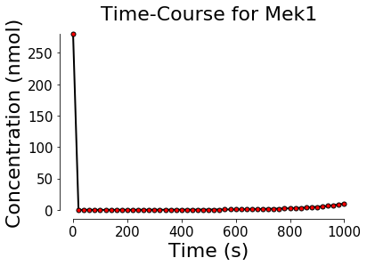


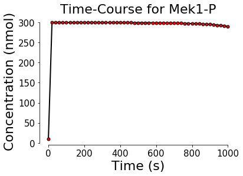


    4. Play around with graph graphics. Note that these arguments are simply passed on to matplotlib and therefore more documenation can be found [here](http://matplotlib.org/)


```python
PyCoTools.pycopi.TimeCourse(K.kholodenko_model,
                            ReportName=K.timecourse_report,
                            End=1000,
                            Intervals=50,
                            StepSize=20,
                            Plot='true',
                            SaveFig='true',
                            LineWidth=8,
                            MarkerSize=15,
                            MarkerColor='g',
                            AxisSize=20,
                            FontSize=25,
                            LineStyle='-',
                            XTickRotation=45,
                            
                           )
```


    <PyCoTools.pycopi.TimeCourse at 0xd750e80>


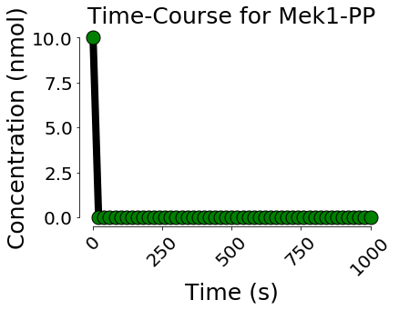


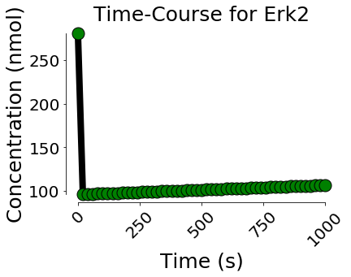


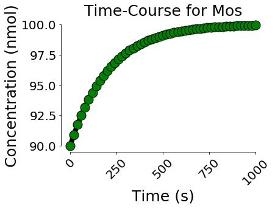


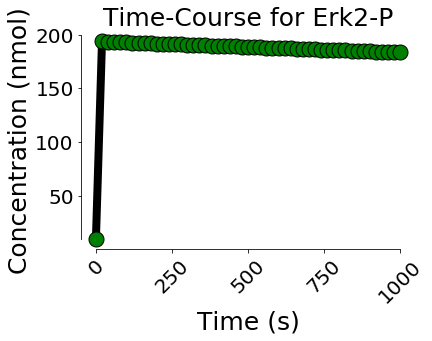


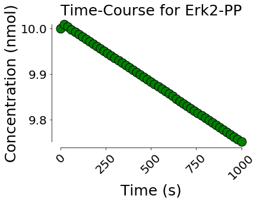


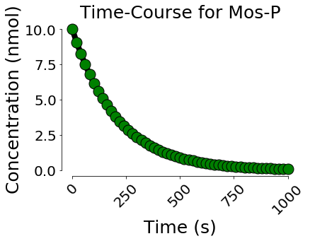


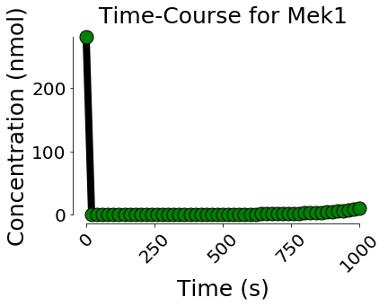


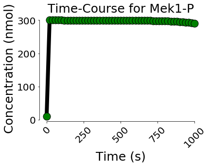


## Add Noise to Time Course

For demonstration purposes, the data simulated in the time course section is used to re-estimate model parameters. To make things more interesting we digress a little and add some noise to what is now referred to as the 'experimental data'. Any custom method can be used for adding noise and while not strictly part of PyCoTools, the following function can be used to add noise to exterimetnal data in a tab delimed `.csv` file (like the default COPASI output). Note that this method of adding noise is bias toward larger valued profiles but in the present context that doesn't really matter. 


```python
import pandas,numpy, FilePaths, os

def add_noise(f, noise_factor=0.05):
    '''
    Add noise to time course data
    
    f:
        Single experiment file to add noise too
    
    noise_factor:
        limits the amount of noise to add. Must be float between 0 and 1
        . default is 0.05 for 5% 
        
    ==========
    Returns: pandas.DataFrame containing noisy data 
    
    '''
    ## check file is real file
    assert os.path.isfile(f),'{} is not a file'.format(f)
    ## read into pandas
    df=pandas.read_csv(f,sep='\t')
    ## Count number of data points to add noise too
    ## remember to account for the time varible by minus 1 from column dimension 
    number_of_data_points= df.shape[0]*(df.shape[1]-1)
    ## sample from uniform distribution 'number_of_data_points' times and assign to u vector
    u= numpy.random.uniform(1-noise_factor,1+noise_factor,number_of_data_points)
    ## reshape u vector
    u_matrix= u.reshape(df.shape[0],df.shape[1]-1)
    ## remove the time colum but save as 't' variable for later
    try:
        
        t=df['Time']
        df.drop('Time',axis=1,inplace=True)
        df_noise=pandas.DataFrame(u_matrix,columns=df.columns)
    except KeyError:
        return None
    ## Check we have the corect shape for matrix
    assert df.shape==df_noise.shape
    ## Perform dot multiplication on two matrices to get noisy matrix
    noise= df_noise.rmul(df,axis=0)
    ## change index to be time
    noise.index=t
    ## return noisy vector
    return noise

if __name__=='__main__':
    ## instantiate FilePaths.KhodenkoExmaple to get necessary file paths
    K=FilePaths.KholodenkoExample()
    ## add noise to simulated kholodenko output and output to tab separated file. 
    add_noise(K.timecourse_report).to_csv(K.noisy_timecourse_report,sep='\t')

```

# Parameter Estimation 

Instructions on how to use the parameter estimation task in COPASI can be found [here](http://copasi.org/Support/User_Manual/Tasks/Parameter_Estimation/). PyCoTools supports the majority of the features of the parameter estimation task via the `ParameterEstimation` class. The `ParameterEstimation` class is the only class in PyCoTools that is not fully automated as it requires additional input from the user. This information can be provided in the form of a configuration file which contains which parameters to estimate and between what boundaries. Once the information is provided a user can run the `set_up()` method to map model variables to experimental data. Note that naming needs to be consistant between data files and the model. In summary, to use the parameter estimation class:

        1.  Instantiate instance of `ParameterEstimation`. This is where arguments and optional keyword arguments 
            such as `Method` and method specific parameters are specified. 
        2.  Use the `write_item_template()` method to create a file called (by default) 'fitItemTemplate.xlsx' 
            containing model variables, start values, boundaries and some additional information
            which is used under the hood for creating fit items. 
        3.  Use the `set_up()` method to set up the parameter estimation.This can be varified by 
            opening the model and looking at the parameter estimation task
        4.  Optionally use the `run()` method to run the model with CopasiSE

## Instantiate Instance of ParameterEstimation

The `ParameterEstimation` class takes two positional arguments - absolute paths to 1) the model and 2) the parameter estimation data. The `ParameterEstimation` class can take lists of experiment files to set up parameter estimations to multiple experiments at the same time. The following are some examples of instantiatin the `ParameterEstimation` class with different settings. 

### Parameter Estimation with a Single Experiment File 

To set up a parameter estimation with a single time course experiment and all other parameters default:


```python
PE= PyCoTools.pycopi.ParameterEstimation(K.kholodenko_model,
                                         K.noisy_timecourse_report)
```

The values of the default parameters are stored in the `PE.kwargs` variable.


```python
for i in sorted(PE.kwargs.keys()):
    print i,PE.kwargs[i]
```

    
                     The below arguments get passed to the parameter
                     estimation plotting class
                     LineWidth 4
    Append 0
    AxisSize 15
    CalculateStatistics 0
    ConfirmOverwrite 0
    CoolingFactor 0.85
    CreateParameterSets 0
    DPI 125
    DotSize 4
    ExperimentType ['timecourse']
    ExtraTitle None
    FirstRow ['1']
    FontSize 22
    GlobalQuantities []
    ItemTemplateFilename D:\MPhil\Python\My_Python_Modules\Modelling_Tools\PyCoTools\PyCoTools\Examples\KholodenkoExample\fitItemTemplate.xlsx
    IterationLimit 50
    LegendLoc best
    LineWidth 3
    LocalParameters ['(phosphorylation of MAPKK).KK3', '(MAPKKK activation).K1', '(dephosphorylation of MAPK-PP).V9', '(phosphorylation of MAPK).k7', '(phosphorylation of MAPK-P).k8', '(MAPKKK inactivation).KK2', '(MAPKKK inactivation).V2', '(phosphorylation of MAPKK).k3', '(phosphorylation of MAPKK-P).k4', '(dephosphorylation of MAPKK-PP).KK5', '(dephosphorylation of MAPK-PP).KK9', '(dephosphorylation of MAPKK-P).KK6', '(phosphorylation of MAPKK-P).KK4', '(MAPKKK activation).V1', '(MAPKKK activation).Ki', '(phosphorylation of MAPK).KK7', '(dephosphorylation of MAPK-P).KK10', '(phosphorylation of MAPK-P).KK8', '(dephosphorylation of MAPKK-PP).V5', '(dephosphorylation of MAPK-P).V10', '(dephosphorylation of MAPKK-P).V6', '(MAPKKK activation).n']
    LowerBound 1e-06
    Metabolites ['Mek1-PP', 'Erk2', 'Mos', 'Erk2-P', 'Erk2-PP', 'Mos-P', 'Mek1', 'Mek1-P']
    Method geneticalgorithm
    NormalizeWeightsPerExperiment ['true']
    NumberOfGenerations 200
    NumberOfIterations 100000
    OutputML D:\MPhil\Python\My_Python_Modules\Modelling_Tools\PyCoTools\PyCoTools\Examples\KholodenkoExample\_Duplicate.cps
    OverwriteItemTemplate false
    Pf 0.475
    Plot true
    PopulationSize 50
    PruneHeaders true
    QuantityType concentration
    RandomNumberGenerator 1
    RandomizeStartValues true
    ReportName D:\MPhil\Python\My_Python_Modules\Modelling_Tools\PyCoTools\PyCoTools\Examples\KholodenkoExample\Kholodenko_PE_results.txt
    Rho 0.2
    RowContainingNames ['1']
    RowOrientation ['true']
    Save overwrite
    SaveFig false
    Scale 10
    Scheduled false
    Seed 0
    Separator ['\t']
    SetReport true
    Show false
    StartTemperature 1
    StartValue None
    StdDeviation 1e-06
    SwarmSize 50
    TitleWrapSize 30
    Tolerance 1e-05
    UpdateModel false
    UpperBound 1000000
    UseTemplateStartValues false
    Verbose false
    WeightMethod ['mean_squared']
    XTickRotation 35
    Xlimit None
    Ylimit None
    

### Parameter Estimation with Two Experiment Files 


```python
## modify the K.noisy_time_course_report that was defined in `FilePaths.KholodenkoExample` so we can simulate another time course 
import os
import FilePaths
K=FilePaths.KholodenkoExample()
second_timecourse= K.noisy_timecourse_report[:-4]+'2.txt'


## run another time course 
PyCoTools.pycopi.TimeCourse(K.kholodenko_model,ReportName=second_timecourse,End=1000,Intervals=50,StepSize=20)

## Provide python list of experimental files to `experiment_files` argument 
PE= PyCoTools.pycopi.ParameterEstimation(K.kholodenko_model,
                                           [K.noisy_timecourse_report,second_timecourse])

## To optionally have a look at the kwargs variable now for comparison, set the `see_kwargs` variable to True. 
see_kwargs=False
if see_kwargs==True:
    for i in sorted(PE.kwargs.keys()):
        print i,PE.kwargs[i]

```

Note that the following varibales automatically change to lists of `len(ExperimentFiles)`:
* RowOrientation
* ExperimentType
* FirstRow
* NormalizeWeightsPerExperiment
* RowContainingNames
* Separator
* WeightMethod

These options are described in detail in the [COPASI manual](http://copasi.org/Support/User_Manual/Tasks/Parameter_Estimation/).

### Steady State Experiments
When setting up parameter estimations in COPASI, it is possible to choose the `steady state` option. By default, PyCoTools expects a time course experiment and if we want to fit a steady state, we have to explicitly say so. In the below example code, `dataset1-3` are assumed to be time course experiment files whereas `dataset4` is steady state. This code is just an example. The variables `dataset1-4` do not actually point to anything which is why the below code produces an error. 


```python
## Keep `run` set to False, because this bit of code is only for illustration and produces error
run=False
if run==True:
    Experiment_type_list=['timecourse','timecourse','timecourse','steadystate']
    PE=P.pycopi.ParameterEstimation(K.kholodenko_model,[dataset1,dataset2,dataset3,dataset4],ExperimentType=Experiment_type_list)
```

For more details on `ParameterEstimation` keyword arguments, please consult the technical documentation.   

## Create a Configuration File

In this example we use the noisy data simulated from the Kholodenko model. 


```python
import FilePaths
K=FilePaths.KholodenkoExample()
PE= PyCoTools.pycopi.ParameterEstimation(K.kholodenko_model,
                                           K.noisy_timecourse_report, 
                                           Method='ParticleSwarm',
                                           PopulationSize=150,
                                           SwarmSize=200,
                                           ReportName=K.PEData_file)
```

Now create an template configuration file specific for the model:


```python
PE.write_item_template()
```


    'writing template. OverwriteItemTemplate set to false and ItemTemplateFilename is D:\\MPhil\\Python\\My_Python_Modules\\Modelling_Tools\\PyCoTools\\PyCoTools\\Examples\\KholodenkoExample\\fitItemTemplate.xlsx'


The `ItemTemplateFilename` kwarg for `ParameterEstimation` can be used to specify custom filename, but we just use the default here. The fit item template looks like this:


Delete rows of this matrix to remove corresponding parameters from the estimation (i.e. to fix variables) and change the boundaries and start values as you please. The start values column usually is not as important as multiple parameter estimations get run with random starting values. Do not modify the remaining columns on the right as these are used internally by PyCoTools. 

## Use the `PE.set_up()` method

No configuration actually happens until you use this method.


```python
PE.set_up()
```

## Run the Parameter Estimation 

The parameter estimation can be run multiple ways:
    1. By opening COPASI, defining the usual plots and running like normal. 
    2. Use the `PE.run()` method
    3. Set `Plot='true'` to plot simulated versus experimental data
    4. Run via the `Scan` task
    5. Copy the model and run several instances at the same time

### Using PE.run()


```python
PE.run()
```

    D:\MPhil\Python\My_Python_Modules\Modelling_Tools\PyCoTools\PyCoTools\Examples\KholodenkoExample\Kholodenko_temp.cps
    ['D:\\MPhil\\Python\\My_Python_Modules\\Modelling_Tools\\PyCoTools\\PyCoTools\\Examples\\KholodenkoExample\\NoisyKholodenkoTimeCourseOutput.txt']
    D:\MPhil\Python\My_Python_Modules\Modelling_Tools\PyCoTools\PyCoTools\Examples\KholodenkoExample\PEResultsFile.txt
    D:\MPhil\Python\My_Python_Modules\Modelling_Tools\PyCoTools\PyCoTools\Examples\KholodenkoExample\PEResultsFile.txt
    


    <PyCoTools.pycopi.Run instance at 0x000000000D5EE108>


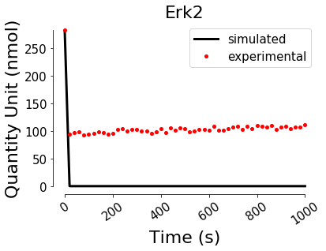


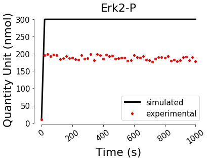


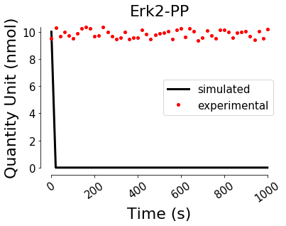


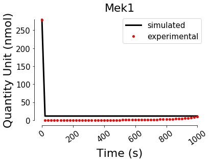


This will run the parameter estimation and write results to file. The filename is an argument to the `ParameterEstimation` `ReportName` kwarg and by default outputs all model variables. It is possible to be selective about which variables to include in the report but generally its easier to accept the default and remove columns with constant values post-running. The data produced from this method of running includes the progression of the estimation algorithm, otherwise known as function evaluations. Therefore the best parameter set found is on the last line of this file. Often however, it is not desirable to include function evaluations in parameter estimation output. This can be avoided by running the parameter estimation via the scan task - see below. 

### The `Plot` kwarg

If `Plot='true'` PyCoTools will insert the estimated parameters back into COPASI before running a time course and plotting the experimental and simulated data on a single canvas (one per estimated parameter). The `SaveFig='true'` argument writes the graphs to file in the model directory.    


```python
PE= PyCoTools.pycopi.ParameterEstimation(K.kholodenko_model,
                                           K.noisy_timecourse_report, 
                                           Method='ParticleSwarm',
                                           PopulationSize=150,
                                           SwarmSize=200,
                                           Plot='true',
                                           SaveFig='true')
PE.set_up()
PE.run()
```

    D:\MPhil\Python\My_Python_Modules\Modelling_Tools\PyCoTools\PyCoTools\Examples\KholodenkoExample\Kholodenko_temp.cps
    ['D:\\MPhil\\Python\\My_Python_Modules\\Modelling_Tools\\PyCoTools\\PyCoTools\\Examples\\KholodenkoExample\\NoisyKholodenkoTimeCourseOutput.txt']
    D:\MPhil\Python\My_Python_Modules\Modelling_Tools\PyCoTools\PyCoTools\Examples\KholodenkoExample\Kholodenko_PE_results.txt
    D:\MPhil\Python\My_Python_Modules\Modelling_Tools\PyCoTools\PyCoTools\Examples\KholodenkoExample\Kholodenko_PE_results.txt
    


    <PyCoTools.pycopi.Run instance at 0x000000000D5D4E08>


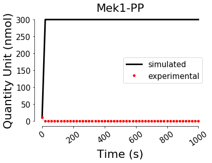


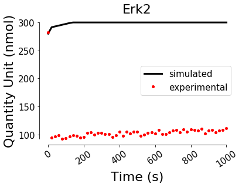


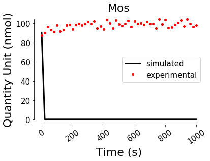


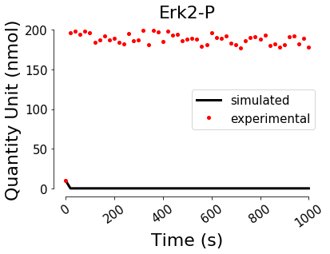


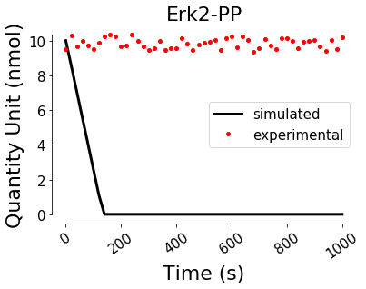


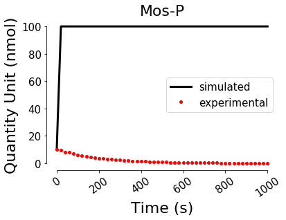


### Running Multiple Parameter Estimations
As we can see from above, we don't usually get a very good fit with the 'one run' approach so its often desirable to run the parameter estimation many times. For this it is possible to set up a repeat item under the scan task. 


```python
PE= PyCoTools.pycopi.ParameterEstimation(K.kholodenko_model,
                                           K.noisy_timecourse_report, 
                                           Method='GeneticAlgorithm', #change to genetic algorithm (why not?)
                                           PopulationSize=80,
                                           NumberOfGenerations = 200,
                                           Plot='false', #don't want to plot this time
                                           SaveFig='false',
                                           RandomizeStartValues='true') #Default'true' anyway
PE.set_up()

PyCoTools.pycopi.Scan(K.kholodenko_model,
                      ScanType='repeat', #set up repeat item under scan. 
                      NumberOfSteps=3, #Run the parameter estimation task 3 times
                      SubTask='parameter_estimation', #this is the default, but included here for demonstration anyway
                      ReportType='parameter_estimation', ## report automatically set up within copasi. 
                      ReportName=K.PEData_file,
                      Run='true') #run the scan task automatically in the background
```


    <PyCoTools.pycopi.Scan instance at 0x000000000EBA8548>


This code first configures and sets up a parameter estimation and instead of running with the `PE.run()` method, we setup a scan task with `ReportType='parameter_estimation'` and `SubTask='parameter_estimation'` kwargs. This scan will run `NumberOfSteps` parameter estimations (3 in this case). The resulting report no longer gives function evaluations for the individual runs but will take the best parameters from each and produce a matrix. 

Note that most of the keyword arguments required to set up a task correspond to those which are required to set up the same task in the COPASI grahical interface. 

### The Copy and Paste Method
When a COPASI parameter estimation is being run, it uses a limited portion of the CPU (~13% on my own machine). It is therefore possible to copy the file and run several instances of identically configured COPASI files. This method is not in-built in PyCoTools but serves as an example of how the combination of Python and COPASI can make life easier for COPASI users. 

Lets define two simple functions, one to copy the `copasi_file` `n` times and another to create `n` output file names for collecting results. 


```python
from shutil import copy
def copy_copasi(copasi_file,n):
    '''
    run a copasi file n times on the same computer 
    '''
    sub_copasi_files_dct={}
    copasi_path,copasi_filename=os.path.split(copasi_file)
    for i in range(n):
        new_cps=os.path.join(copasi_path,copasi_filename[:-4]+'{}.cps'.format(str(i)))
        copy(copasi_file,new_cps)
        sub_copasi_files_dct[i]= new_cps
    return sub_copasi_files_dct

def enumerate_PE_output(output_filename,n):
    '''
    make some more filenames for our analysis
    '''
    dct={}
    dire,fle=os.path.split(output_filename)
    output_dir=os.path.join(dire,'Results')
    if os.path.isdir(output_dir)!=True:
        os.mkdir(output_dir)
    
    for i in range(n):
        new_file=os.path.join(output_dir,fle[:-4]+'{}.txt'.format(str(i)))
        dct[i]=new_file
    return dct

if __name__=='__main__':
    n=3
    copasi_files=copy_copasi(K.kholodenko_model,n)
    result_files=enumerate_PE_output(K.PEData_file,n)
```

The `K.kholodenko_model` has now been copied three times and their paths are contained within the python dictionary `copasi_files`.  These files are identically configured since the parameter estimation task set up was done prior to copying. It is necessary now to loop over the models and set up a scan task for each, since they all need different `ReportName` arguments. 


```python
for i in range(n):
    '''
    Set up n repeat items with NumberOfSteps repeats of parameter estimation
    '''
    PyCoTools.pycopi.Scan(copasi_files[i],
                      ScanType='repeat', 
                      NumberOfSteps=3, #run each model this number of times
                      SubTask='parameter_estimation',
                      ReportType='parameter_estimation', 
                      ReportName=result_files[i], #new output file name
                      Run='false') #run the scan task automatically in the background
```

We could set `Run='true'` but this would run each model in series. Instead it is possible to set `Run='false'` and pass a list of COPASI files to the `Run` class, using `multiprocess` mode. This opens a subprocess per copasi file and therefore runs multiple files at once.


```python
import PyCoTools
for i in copasi_files.values():
    PyCoTools.pycopi.Run(i,Mode='multiprocess',Task='scan')
```

Care should be taken when using this approach since running too many files at once can render a computer unusable until the files have finished running. My own machine (8 cores, i7 processor and 16GB RAM) starts to get sluggish at around 6-8 models and becomes unusable with more. 

### On a Cluster
Lastly, for those with a SGE based cluster, `Run` can be set to `SGE` to run on the cluster. Additional `Modes` can be easily written for clusters for other job schedulers by adding a method under the `Run` class and providing an extra option to the Run class. See `Running on a Cluster` section.

# Parameter Estimation Analysis

While COPASI is excellant for generation of parameter estimation data, users are largely left to their own devices when it comes to analysing this data. PyCoTools provides the `PEAnalysis` module which is designed specifically for quickly visualizing parameter estimation data, whether generated by COPASI or elsewhere. This section describes how to use the `PEAnalysis` module. For an example on a possible workflow that COPASI users can follow to find best fitting parameters see the [workflow tutorial](https://github.com/CiaranWelsh/PyCoTools/blob/develop/PyCoTools/Examples/KholodenkoExample/ModelCalibrationWorkflow.ipynb).

The PEAnalysis module includes feature to:
* Parse parameter estimation data into a python environment (`pandas.DataFrame`)
* Quickly produce customizable:
    * Boxplots
    * Optimization performance graphs
    * Histograms
    * Scatter graphs
    * Hex plots
* In future releases, `PyCoTools` will enable:
    * Heat maps displaying various statistics about the parameter estimation data.
    * Contours on the scatter/Hex with chi2 based confidence level.
    * And possibly principle component analysis, once I figure out whether its useful or not. 

The `InsertParameters` and `ParameterEstimation` classes are also useful in this context to visualize best fits against experimental data.

## Parsing Data

The majority of the time a user does not need the `PEAnalysis.ParsePEData` class since the other classes use it implicitly, however it is useful to have access to the raw data sometimes, specifically when custom analyses are required or when data from multiple runs reside in multiple files within a folder. 


```python
import PyCoTools
import FilePaths
K=FilePaths.KholodenkoExample()
data=PyCoTools.PEAnalysis.ParsePEData(K.PEData_file).data ## Data is held in the data attribute of the ParsePEData class
```

When the ParsePEData class is used, it automatically prodces a `pickle` file containing a `pandas.DataFrame`. It is possible to set the `UsePickle='true'` and `OverwritePickle='false'` to speed up parsing. The ParsePEData class accepts `.xls, .xls, .csv, .tsv,` or `.pickle` files or a folder containing many of these files as argument (from the same problem).


```python
data=PyCoTools.PEAnalysis.ParsePEData(K.PEData_file,UsePickle='true',OverwritePickle='false').data
```

Since a demonstration of this module works best with a large number of parameter estimation iterations, all the kinetic parameters in the [kholodenko2000 model](http://www.ebi.ac.uk/biomodels-main/BIOMD0000000010) were re-estimated 4000 times using COPASIs genetic algorithm with a population size of 300 and generation number of 1000. Only the kinetic variables were estimated using wide boundaries between 1e-6 to 1e6 and all the noisy data simualted above were used as experimental data. Additionally, the parameter estiamtions were run on a cluster using the scripts under the `Scripts` folder in the PyCoTools distribution. 

This data is available as a python pickle file called [1GlobalPEData.pickle](https://github.com/CiaranWelsh/PyCoTools/tree/master/PyCoTools/Examples/KholodenkoExample). After download, put it in your working directory and make sure there is a pointer to it in the `FilePath.KholodenkoExample` class.


```python
## Print out best parameters from pickle file
import FilePaths
import PyCoTools
K=FilePaths.KholodenkoExample()

PEdata=PyCoTools.PEAnalysis.ParsePEData(K.PE_data_global1)
print PEdata.data ## Data is within the data attribute
```

          (phosphorylation of MAPKK).KK3  (MAPKKK activation).K1  \
    0                           10.97700                0.000026   
    1                            8.34545                0.017482   
    2                           11.21920                0.000501   
    3                           10.77040                0.010498   
    4                           13.59150                0.135456   
    5                           11.02270                3.100940   
    6                           10.19820                0.000907   
    7                            9.09969                0.000719   
    8                            9.52781                1.599150   
    9                           15.22330                0.001848   
    10                           7.67423                0.111546   
    11                          10.90720                0.000173   
    12                          12.15560                0.013859   
    13                           9.55123                2.913790   
    14                          15.26700                0.005305   
    15                          16.22120                0.000288   
    16                           8.46230                0.105678   
    17                          12.50900                0.052988   
    18                          11.76270                0.077067   
    19                           8.92848                0.441146   
    20                          10.69070                0.001046   
    21                          13.17410                0.000083   
    22                          14.15270                0.000226   
    23                           8.54098                0.000198   
    24                           8.55397                0.000305   
    25                           6.84375                0.011456   
    26                           9.39844                0.000211   
    27                           7.55780                0.036219   
    28                          13.59530                0.002430   
    29                          12.86070                2.894450   
    ...                              ...                     ...   
    3970                         5.93332                0.583290   
    3971                         7.60974               30.698400   
    3972                         8.14084                0.000032   
    3973                        40.77540                0.115966   
    3974                        13.64870                3.553790   
    3975                        27.32200                0.036998   
    3976                        37.91590                0.006071   
    3977                        27.54550                0.047948   
    3978                         1.71692                4.312900   
    3979                        11.95620                0.198424   
    3980                        10.17550                0.012947   
    3981                         8.68000                0.000896   
    3982                        19.24600               52.658000   
    3983                        19.94160                3.502560   
    3984                        31.41400                0.014728   
    3985                        26.46460                2.288320   
    3986                         8.24535                0.017839   
    3987                         8.28343                0.075564   
    3988                        15.43030                0.000311   
    3989                        16.34980                0.000044   
    3990                        26.58730                0.081265   
    3991                        35.11590                0.122739   
    3992                        12.49370                0.000221   
    3993                        13.71700               30.565800   
    3994                         2.40484                3.084040   
    3995                         6.05879                0.000690   
    3996                        17.33500               10.405300   
    3997                        31.76090                0.212992   
    3998                        41.59460                0.019306   
    3999                         2.82722                0.473135   
    
          (dephosphorylation of MAPK-PP).V9  (phosphorylation of MAPK-P).k8  \
    0                              0.000262                        0.899837   
    1                              0.000278                        0.149430   
    2                              0.001077                        1.137980   
    3                              0.016850                        0.623405   
    4                              0.000576                        0.548143   
    5                              0.000005                        1.243320   
    6                              0.000233                        4.006230   
    7                              0.002349                        2.884630   
    8                              0.000033                        0.154211   
    9                              0.000024                        2.387550   
    10                             0.000028                        0.509028   
    11                             2.184770                        1.466240   
    12                             0.000013                        2.522080   
    13                             0.000001                        0.107473   
    14                             0.000006                        3.491940   
    15                             0.000002                        3.000400   
    16                             0.000024                        0.251879   
    17                             0.000836                        0.210914   
    18                             0.000001                        4.386630   
    19                             0.000067                        1.757530   
    20                             0.000783                        7.811360   
    21                             0.000021                        6.040100   
    22                             0.000001                        3.670580   
    23                             0.000036                        0.125240   
    24                             0.002023                        4.301470   
    25                             0.484621                        0.323053   
    26                             0.000009                        0.057494   
    27                             0.000004                        2.274780   
    28                             0.000001                        0.209427   
    29                             0.000002                        0.158968   
    ...                                 ...                             ...   
    3970                           0.010691                        0.014483   
    3971                           0.000001                        6.923430   
    3972                           0.001198                        0.411857   
    3973                           0.000011                        0.080181   
    3974                           0.343550                        0.027843   
    3975                           0.000008                        0.019737   
    3976                           0.004235                        0.028474   
    3977                           0.000005                        0.042674   
    3978                           0.000114                        0.018849   
    3979                           0.000299                        0.018668   
    3980                           0.342319                        0.013848   
    3981                           0.065519                        0.494554   
    3982                           0.000004                        0.064993   
    3983                           0.001904                        0.015926   
    3984                           0.000052                        0.122810   
    3985                           0.000104                        0.059857   
    3986                           0.155590                        0.015191   
    3987                           0.000013                        0.012863   
    3988                           0.000270                        0.014198   
    3989                           0.000127                        0.522355   
    3990                           0.000002                        0.013745   
    3991                           0.086352                        0.062206   
    3992                           0.000010                        0.012598   
    3993                           0.380170                        0.040454   
    3994                           0.375907                        0.023297   
    3995                           0.190684                        0.024886   
    3996                           0.220124                        0.024892   
    3997                           0.000733                        4.578110   
    3998                           0.225752                        0.018186   
    3999                           0.176261                        0.039046   
    
          (MAPKKK inactivation).KK2  (MAPKKK inactivation).V2  \
    0                      861.9000                  4.181950   
    1                     1759.3800                  7.892360   
    2                     1084.2300                  4.965650   
    3                     1147.0600                  5.138130   
    4                      513.1170                  2.647150   
    5                      130.4450                  0.822571   
    6                      598.1650                  2.826570   
    7                      342.0990                  1.771580   
    8                      244.8780                  1.495500   
    9                      583.0910                  2.741480   
    10                     697.2440                  3.266700   
    11                     363.1540                  1.796990   
    12                    1327.2000                  6.121890   
    13                     164.2810                  0.934919   
    14                     548.6320                  2.575390   
    15                    1036.9000                  4.766860   
    16                     332.2760                  1.735330   
    17                     643.9470                  3.262070   
    18                     990.3670                  4.461140   
    19                     445.6380                  2.272870   
    20                    1503.3300                  6.672380   
    21                    1808.9200                  8.370250   
    22                     323.7780                  1.659040   
    23                     318.8960                  1.629350   
    24                     314.1030                  1.652140   
    25                     704.9660                  3.328260   
    26                     356.6180                  1.935770   
    27                    1070.2600                  5.320740   
    28                     604.7540                  2.956200   
    29                      85.1503                  0.763452   
    ...                         ...                       ...   
    3970                   180.2410                  1.097380   
    3971                    27.8685                  0.332567   
    3972                    37.0608                  0.366579   
    3973                    41.5390                  0.434737   
    3974                  3588.7800                 14.204100   
    3975                    83.4187                  0.651405   
    3976                    46.1453                  0.618366   
    3977                    38.4257                  0.457822   
    3978                    40.7420                  0.507169   
    3979                  4390.5400                 20.539900   
    3980                   496.1090                  2.863810   
    3981                  1951.3100                  9.249980   
    3982                    18.2763                  0.282412   
    3983                   109.8960                  0.735485   
    3984                    29.1826                  0.615012   
    3985                    34.7768                  0.371847   
    3986                  5893.8500                 24.429900   
    3987                   279.5060                  1.642100   
    3988                   164.3870                  0.957303   
    3989                    41.4008                  0.617429   
    3990                    84.8372                  0.668164   
    3991                    25.5405                  0.357668   
    3992                    63.3720                  0.798898   
    3993                    24.5460                  0.307736   
    3994                   127.9260                  0.882040   
    3995                   973.1240                  4.697050   
    3996                   110.8840                  0.527067   
    3997                    33.0853                  0.369788   
    3998                    18.7308                  0.444470   
    3999                   872.9990                  3.452730   
    
          (phosphorylation of MAPKK-P).k4  (dephosphorylation of MAPKK-PP).KK5  \
    0                            0.052038                             0.000197   
    1                            0.052130                             0.000002   
    2                            0.095480                             0.006171   
    3                            0.054885                             0.000259   
    4                            0.102928                             0.000007   
    5                            0.093901                             0.000439   
    6                            0.076617                             0.000015   
    7                            0.075861                             0.021539   
    8                            0.054433                             0.006931   
    9                            0.054523                             0.004240   
    10                           0.053516                             0.099890   
    11                           0.147141                             0.000033   
    12                           0.063297                             0.013791   
    13                           0.084358                             0.015301   
    14                           0.071683                             0.000017   
    15                           0.057698                             0.027536   
    16                           0.092953                             0.000438   
    17                           0.067045                             0.000171   
    18                           0.093170                             0.000007   
    19                           0.117250                             0.000007   
    20                           0.044188                             0.002197   
    21                           0.052576                             0.005949   
    22                           0.137952                             0.068147   
    23                           0.098337                             0.000092   
    24                           0.115808                             0.001000   
    25                           0.060598                             0.000042   
    26                           0.090271                             0.005910   
    27                           0.073079                             0.013713   
    28                           0.203180                             0.000021   
    29                           0.056903                             0.311926   
    ...                               ...                                  ...   
    3970                         0.222518                             0.002578   
    3971                         0.082108                            11.318700   
    3972                         0.229810                            28.622600   
    3973                         0.082259                            62.080700   
    3974                         0.051684                             0.006333   
    3975                         0.137817                            44.381300   
    3976                         0.057826                            38.584200   
    3977                         0.128538                            68.690200   
    3978                         0.120730                            14.384100   
    3979                         0.342275                             0.000004   
    3980                         0.034328                             0.000087   
    3981                         0.130463                            32.996600   
    3982                         0.041760                            18.950800   
    3983                         0.115948                             0.001552   
    3984                         0.058754                            77.557600   
    3985                         0.099219                            65.483900   
    3986                         0.112310                             0.000219   
    3987                         0.146714                             0.003200   
    3988                         0.103614                             0.053214   
    3989                         0.331044                            50.116800   
    3990                         0.134000                            30.251700   
    3991                         0.123544                            92.589000   
    3992                         0.304575                            40.014200   
    3993                         0.322482                            34.381700   
    3994                         0.142249                             0.000008   
    3995                         0.071618                            36.000700   
    3996                         0.109077                             0.000046   
    3997                         0.131272                            69.291600   
    3998                         0.080678                            64.047600   
    3999                         0.052452                             0.001363   
    
          (dephosphorylation of MAPK-PP).KK9  (dephosphorylation of MAPKK-P).KK6  \
    0                               0.000002                            605057.0   
    1                              66.227700                             92134.0   
    2                         1000000.000000                            832077.0   
    3                               0.000004                            123609.0   
    4                               0.001294                            178184.0   
    5                              13.319700                            760767.0   
    6                               1.234280                            493240.0   
    7                             570.233000                            238348.0   
    8                               0.000020                             83549.9   
    9                              87.590700                            320984.0   
    10                              0.000192                            188401.0   
    11                         230449.000000                            173765.0   
    12                              0.274970                            103758.0   
    13                              0.320905                             90769.1   
    14                           1763.570000                            401526.0   
    15                              4.643570                            740646.0   
    16                              0.000002                             97603.2   
    17                         625400.000000                             94592.2   
    18                          84770.100000                            238047.0   
    19                              0.008461                            301129.0   
    20                              0.000362                            769764.0   
    21                            264.629000                            382559.0   
    22                          19005.100000                            168943.0   
    23                            182.972000                            218264.0   
    24                          88480.800000                            495198.0   
    25                         365232.000000                            605227.0   
    26                         202248.000000                            373134.0   
    27                              0.058385                            548385.0   
    28                              3.836550                            158192.0   
    29                             74.523500                            456860.0   
    ...                                  ...                                 ...   
    3970                            0.000002                            368857.0   
    3971                            0.000247                            271146.0   
    3972                         1086.710000                            391078.0   
    3973                        23754.800000                            785979.0   
    3974                           14.375000                            342722.0   
    3975                            0.002864                           1000000.0   
    3976                            0.000001                           1000000.0   
    3977                            0.000003                            303182.0   
    3978                        83379.700000                            196943.0   
    3979                          204.893000                            220709.0   
    3980                         1250.020000                             92292.4   
    3981                            0.000071                            186766.0   
    3982                       127259.000000                            915994.0   
    3983                          948.710000                            138361.0   
    3984                        30352.400000                            257275.0   
    3985                            0.000071                            375070.0   
    3986                            0.000001                            860462.0   
    3987                       351886.000000                            610100.0   
    3988                        18245.000000                            836881.0   
    3989                       139062.000000                            206341.0   
    3990                        41816.100000                            587887.0   
    3991                       119303.000000                            703067.0   
    3992                            0.000023                            180548.0   
    3993                        47682.700000                            743542.0   
    3994                            0.153710                            773334.0   
    3995                            0.000019                            388084.0   
    3996                            0.000003                            485578.0   
    3997                            0.019126                            925583.0   
    3998                        10898.300000                            582311.0   
    3999                            0.000002                            346833.0   
    
          (phosphorylation of MAPKK-P).KK4  (MAPKKK activation).V1  \
    0                              66.5179                 7.39701   
    1                              66.9832                32.76750   
    2                             159.8630                22.95410   
    3                              74.1093                20.83720   
    4                             174.5840                 4.30112   
    5                             155.7670                 4.54789   
    6                             118.6800                15.53970   
    7                             119.7590                 6.50349   
    8                              73.5585                 3.09457   
    9                              69.8749                20.89220   
    10                             70.4802                15.77630   
    11                            276.5700                20.91140   
    12                             95.5648                13.21060   
    13                            136.3080                10.23120   
    14                            109.0380                80.33080   
    15                             77.8416                15.79420   
    16                            153.9650                 8.22656   
    17                            105.2540                 4.71325   
    18                            163.8970                55.58480   
    19                            203.7090                 6.87269   
    20                             50.9875                63.64120   
    21                             70.0266                 9.45786   
    22                            248.5290                12.46650   
    23                            161.8900                12.87450   
    24                            204.1800                 6.38554   
    25                             87.0037                36.64500   
    26                            147.7220                 5.59687   
    27                            108.4660                 5.35208   
    28                            393.2480                 6.37583   
    29                             78.1723                 2.13345   
    ...                                ...                     ...   
    3970                          450.8370                 6.60236   
    3971                          148.1190                 8.48387   
    3972                          487.7730                12.99290   
    3973                          165.2230               129.86300   
    3974                           60.1695                18.92020   
    3975                          338.0860                35.13390   
    3976                          111.3700                 2.14276   
    3977                          326.8040                 6.94859   
    3978                          237.5750                 2.65954   
    3979                          680.9610                 5.24903   
    3980                           25.8733                 8.17574   
    3981                          280.5880                11.99000   
    3982                           56.2731                80.86720   
    3983                          202.3430                 8.08397   
    3984                          131.9690                 1.79179   
    3985                          258.0880               144.48400   
    3986                          198.4840                13.54480   
    3987                          244.2420                11.76710   
    3988                          175.9040               145.46200   
    3989                          859.0290                 1.60760   
    3990                          278.0420                23.48230   
    3991                          293.4390                45.30840   
    3992                          749.0910                 2.34426   
    3993                          792.3050               169.75900   
    3994                          243.5740                 1.48863   
    3995                          142.2160                 2.53005   
    3996                          192.9490                 3.94705   
    3997                          320.5990                14.93600   
    3998                          156.8670                 2.03310   
    3999                           65.3656                 6.20469   
    
          (MAPKKK activation).Ki  (phosphorylation of MAPK).KK7  \
    0                   1.888390                       0.000137   
    1                   0.379970                       0.992381   
    2                   0.536175                       0.000576   
    3                   0.560131                       0.000187   
    4                   3.668410                       0.197859   
    5                   3.800960                       0.013567   
    6                   0.808809                       0.001360   
    7                   2.106050                       0.090231   
    8                   6.908840                       0.001686   
    9                   0.589728                       0.046937   
    10                  0.817726                       0.250294   
    11                  0.584081                       0.043814   
    12                  1.006490                       0.000162   
    13                  1.402020                       0.000538   
    14                  0.147022                       0.004562   
    15                  0.814516                       0.055021   
    16                  1.645340                       0.004189   
    17                  3.389320                       0.109754   
    18                  0.218808                       0.014302   
    19                  2.072090                       0.004926   
    20                  0.190328                       0.412551   
    21                  1.452330                       0.001207   
    22                  1.009330                       0.296486   
    23                  0.969083                       0.014586   
    24                  2.182800                       0.012409   
    25                  0.335900                       0.800166   
    26                  2.719790                       4.457010   
    27                  2.836150                       0.000243   
    28                  2.207110                       0.435565   
    29                 15.089500                       0.001599   
    ...                      ...                            ...   
    3970                2.776110                       7.638650   
    3971                3.471440                       0.006020   
    3972                0.997446                       0.011985   
    3973                0.100000                       0.012810   
    3974                0.485024                       0.210454   
    3975                0.484816                       0.053902   
    3976               16.712500                       0.005432   
    3977                2.447260                       0.126271   
    3978               12.605300                       0.000204   
    3979                3.190450                       0.957317   
    3980                2.336300                      26.604000   
    3981                1.051710                       0.066083   
    3982                0.412038                       0.094117   
    3983                2.329970                       0.000490   
    3984               29.101900                       0.004096   
    3985                0.103412                       0.002202   
    3986                0.585916                       2.397670   
    3987                1.441220                      14.727700   
    3988                0.100000                       3.308890   
    3989               27.398400                       0.000221   
    3990                0.793675                       5.986500   
    3991                0.301362                       0.000636   
    3992               17.757500                      25.412800   
    3993                0.152667                       0.026960   
    3994               13.476500                       0.019644   
    3995                5.444960                       0.001017   
    3996                1.390070                       0.000712   
    3997                0.953132                       0.101878   
    3998               19.249500                      14.440200   
    3999                0.486296                       0.003225   
    
          (dephosphorylation of MAPK-P).KK10  (phosphorylation of MAPK-P).KK8  \
    0                            6864.030000                       3409.55000   
    1                          498133.000000                        507.24500   
    2                            1141.240000                       4236.50000   
    3                           27897.100000                       2248.72000   
    4                          994379.000000                       2064.93000   
    5                           29723.200000                       4586.28000   
    6                           38693.100000                      15465.30000   
    7                           37029.600000                      10974.60000   
    8                            8833.080000                        535.90400   
    9                           11564.300000                       8903.84000   
    10                          50541.500000                       1865.81000   
    11                          10767.100000                       5423.73000   
    12                            330.722000                       9785.04000   
    13                           6026.250000                        348.49000   
    14                          50324.300000                      13161.20000   
    15                            917.575000                      11370.40000   
    16                         335159.000000                        921.61700   
    17                          13789.000000                        748.91900   
    18                         365961.000000                      16709.20000   
    19                          35148.900000                       6701.35000   
    20                           2503.760000                      28583.80000   
    21                            115.607000                      23599.70000   
    22                            714.647000                      14087.20000   
    23                           1316.140000                        426.65700   
    24                         690270.000000                      16364.40000   
    25                          93191.300000                       1176.90000   
    26                         508123.000000                        169.66900   
    27                            363.931000                       8835.21000   
    28                          12516.400000                        758.01400   
    29                           3793.260000                        546.81300   
    ...                                  ...                              ...   
    3970                         2076.090000                          4.70431   
    3971                       138935.000000                      26481.70000   
    3972                          305.065000                       1589.58000   
    3973                            0.008862                        272.25500   
    3974                           61.059200                         32.25370   
    3975                          148.846000                         28.09960   
    3976                          332.740000                         56.09660   
    3977                           41.802500                        121.69200   
    3978                           28.024600                         22.54170   
    3979                         7287.040000                         14.25100   
    3980                       139681.000000                          5.49606   
    3981                           63.899000                       1948.73000   
    3982                            0.000084                        212.35000   
    3983                        61608.500000                          8.95405   
    3984                            0.071442                        420.40300   
    3985                           35.434500                        171.43600   
    3986                       230825.000000                          1.80783   
    3987                       507491.000000                          1.15269   
    3988                        43745.200000                          3.52186   
    3989                        68676.500000                       1778.98000   
    3990                            8.029540                          5.58090   
    3991                            0.045383                        188.43200   
    3992                          777.458000                          3.60576   
    3993                       322664.000000                        112.83600   
    3994                           16.378800                         18.74650   
    3995                          141.388000                         37.72560   
    3996                         9844.480000                         23.46340   
    3997                        22345.800000                      15503.60000   
    3998                       196522.000000                         15.18130   
    3999                       749180.000000                         78.05770   
    
          (dephosphorylation of MAPK-P).V10  (dephosphorylation of MAPKK-P).V6  \
    0                              0.401565                            7132.05   
    1                              0.484580                            1152.82   
    2                              0.450130                            9755.65   
    3                              0.549123                            1516.85   
    4                              0.184559                            2038.80   
    5                              0.100000                            9052.45   
    6                              1.101070                            6114.99   
    7                              0.131083                            2828.38   
    8                             13.496400                            1000.00   
    9                              3.621620                            3759.85   
    10                             3.399400                            2404.12   
    11                             0.642510                            2041.93   
    12                             0.315158                            1263.50   
    13                             0.262376                            1074.38   
    14                             0.230743                            4722.78   
    15                             0.261597                            8599.69   
    16                             0.100000                            1205.96   
    17                             0.220860                            1129.73   
    18                             0.522256                            2823.89   
    19                            11.212900                            3597.54   
    20                             0.179910                            9486.88   
    21                             0.165468                            4645.02   
    22                             0.198707                            1941.40   
    23                             0.156426                            2694.36   
    24                             0.912752                            6081.40   
    25                             0.105079                            7804.47   
    26                             0.943120                            4487.29   
    27                             0.481115                            6952.24   
    28                             0.195767                            1826.48   
    29                             0.353405                            5472.14   
    ...                                 ...                                ...   
    3970                           0.100000                            4787.57   
    3971                         789.706000                            3331.56   
    3972                           1.910510                            4338.72   
    3973                           0.197893                            6045.00   
    3974                           0.289425                            4146.10   
    3975                           1.459200                           10000.00   
    3976                           1.843140                            8386.43   
    3977                           0.579888                            2345.10   
    3978                           0.335934                            2605.01   
    3979                           0.701292                            2468.23   
    3980                           1.611550                            1120.80   
    3981                           0.795204                            2299.66   
    3982                           0.298905                            9207.65   
    3983                         294.118000                            1463.68   
    3984                           0.134617                            2278.65   
    3985                           0.355353                            3270.58   
    3986                         949.574000                            9883.64   
    3987                          14.952700                            7531.53   
    3988                           0.234043                           10000.00   
    3989                         112.292000                            2300.13   
    3990                           0.193223                            5760.45   
    3991                           0.196223                            5777.42   
    3992                           0.744593                            2065.18   
    3993                        2563.740000                            8591.96   
    3994                           0.337506                           10000.00   
    3995                           1.410730                            4620.58   
    3996                           0.407210                            5623.43   
    3997                          98.055300                            7946.43   
    3998                           0.194495                            4910.51   
    3999                        2333.390000                            3821.73   
    
               RSS  
    0      131.855  
    1      140.398  
    2      141.806  
    3      142.563  
    4      146.746  
    5      147.941  
    6      148.441  
    7      148.674  
    8      149.004  
    9      149.280  
    10     149.673  
    11     150.306  
    12     151.324  
    13     151.465  
    14     151.765  
    15     152.449  
    16     152.781  
    17     153.400  
    18     153.693  
    19     154.673  
    20     154.950  
    21     155.137  
    22     155.452  
    23     155.756  
    24     156.227  
    25     156.460  
    26     156.519  
    27     156.580  
    28     156.770  
    29     157.241  
    ...        ...  
    3970   757.853  
    3971   758.670  
    3972   771.457  
    3973   771.916  
    3974   777.016  
    3975   778.084  
    3976   788.616  
    3977   789.056  
    3978   790.366  
    3979   805.350  
    3980   807.666  
    3981   815.079  
    3982   824.382  
    3983   839.838  
    3984   849.953  
    3985   851.236  
    3986   853.565  
    3987   888.452  
    3988   903.067  
    3989   940.866  
    3990   943.611  
    3991   947.875  
    3992   951.398  
    3993   972.698  
    3994  1004.960  
    3995  1057.630  
    3996  1182.600  
    3997  1202.470  
    3998  1325.460  
    3999  1519.000  
    
    [4000 rows x 19 columns]
    

## Visualize Optimization Performance


```python
PyCoTools.PEAnalysis.EvaluateOptimizationPerformance(K.PE_data_global1,Log10='true')
```


    <PyCoTools.PEAnalysis.EvaluateOptimizationPerformance instance at 0x000000000F3D6508>


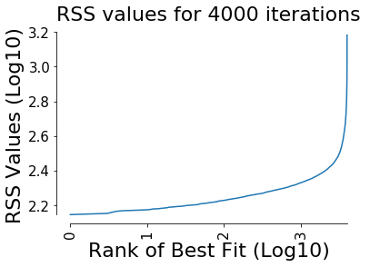


This is a plot of the ordered likelihood (or RSS value) against iteration. The smooth curve indicates that the parameter estimation settings chosen for this problem are not a good choice. The absence of a monotonically increasing'step-like' shape suggests many optimizations are falling short of the minima that they are trying to find (Raue 2013). 

## Simulations Versus Experiment Plots

By chaining together the `InsertParameter` class with the `ParameterEstimation` class using the `CurrentSolutionStatistics` method, setting `Plot='true'` and `RandomizeStartValues='false'`, we can visualize a plot of simulated versus experimental data.  Note we could also set `Index=1` to get a visual on the second best parameter set (and so on).


```python
PEData=PyCoTools.PEAnalysis.ParsePEData(K.PE_data_global1)

print 'best estimated parameters:\n',PEData.data.iloc[0].sort_index()
PyCoTools.pycopi.InsertParameters(K.kholodenko_model,ParameterPath=K.PE_data_global1,Index=0)
PE=PyCoTools.pycopi.ParameterEstimation(K.kholodenko_model,K.noisy_timecourse_report,
                                        Method='CurrentSolutionStatistics',
                                        Plot='true',
                                        SaveFig='false',
                                        RandomizeStartValues='false') #important to turn this off
PE.set_up() ## setup
PE.run()    ## and run the current solution statistics parameter estimation
```

    best estimated parameters:
    (MAPKKK activation).K1                      0.000026
    (MAPKKK activation).Ki                      1.888390
    (MAPKKK activation).V1                      7.397010
    (MAPKKK inactivation).KK2                 861.900000
    (MAPKKK inactivation).V2                    4.181950
    (dephosphorylation of MAPK-P).KK10       6864.030000
    (dephosphorylation of MAPK-P).V10           0.401565
    (dephosphorylation of MAPK-PP).KK9          0.000002
    (dephosphorylation of MAPK-PP).V9           0.000262
    (dephosphorylation of MAPKK-P).KK6     605057.000000
    (dephosphorylation of MAPKK-P).V6        7132.050000
    (dephosphorylation of MAPKK-PP).KK5         0.000197
    (phosphorylation of MAPK).KK7               0.000137
    (phosphorylation of MAPK-P).KK8          3409.550000
    (phosphorylation of MAPK-P).k8              0.899837
    (phosphorylation of MAPKK).KK3             10.977000
    (phosphorylation of MAPKK-P).KK4           66.517900
    (phosphorylation of MAPKK-P).k4             0.052038
    RSS                                       131.855000
    Name: 0, dtype: float64
    D:\MPhil\Python\My_Python_Modules\Modelling_Tools\PyCoTools\PyCoTools\Examples\KholodenkoExample\Kholodenko_temp.cps
    ['D:\\MPhil\\Python\\My_Python_Modules\\Modelling_Tools\\PyCoTools\\PyCoTools\\Examples\\KholodenkoExample\\NoisyKholodenkoTimeCourseOutput.txt']
    D:\MPhil\Python\My_Python_Modules\Modelling_Tools\PyCoTools\PyCoTools\Examples\KholodenkoExample\Kholodenko_PE_results.txt
    D:\MPhil\Python\My_Python_Modules\Modelling_Tools\PyCoTools\PyCoTools\Examples\KholodenkoExample\Kholodenko_PE_results.txt
    


    <PyCoTools.pycopi.Run instance at 0x0000000011B193C8>


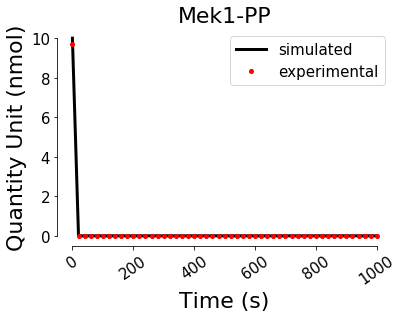


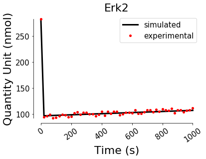


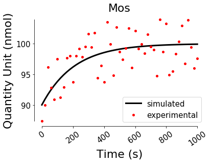


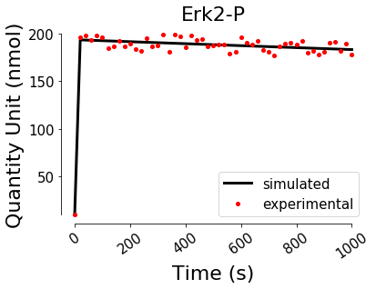


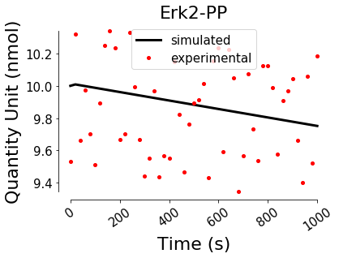


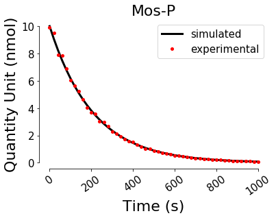


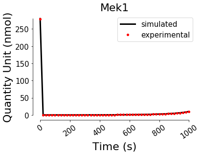


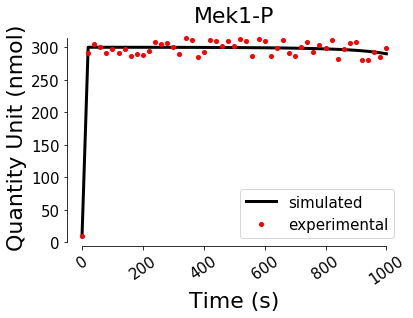


## Boxplots


```python
PyCoTools.PEAnalysis.PlotBoxplot(K.PE_data_global1,SaveFig='false',NumPerPlot=6)
```


    <PyCoTools.PEAnalysis.PlotBoxplot instance at 0x000000000E0E4D48>


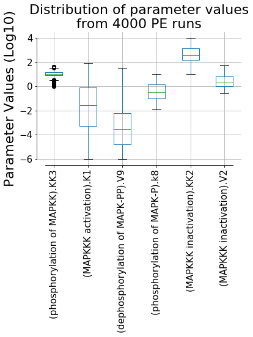


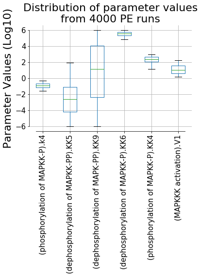


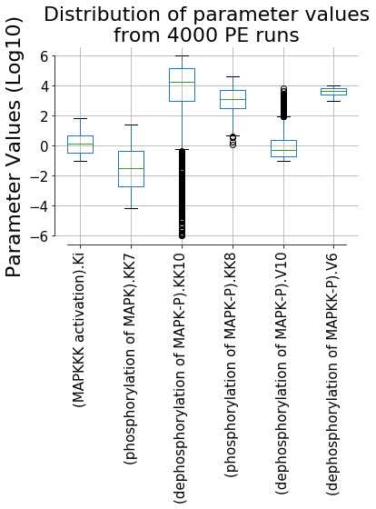


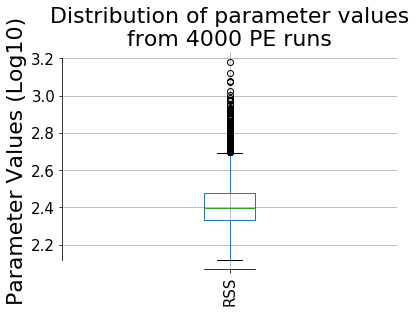


Since a large portion of the parameter estimations are 'bad' runs its often useful to truncate the data to below a certain value of RSS. A `below_x` value of `2.3` was chosen based on the `OptimizationPerformance` graph. 


```python
PyCoTools.PEAnalysis.PlotBoxplot(K.PE_data_global1,SaveFig='false',NumPerPlot=15,TruncateMode='below_x',X=2.3)
```


    <PyCoTools.PEAnalysis.PlotBoxplot instance at 0x000000000F76DEC8>


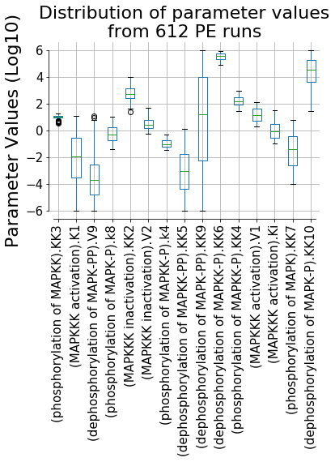


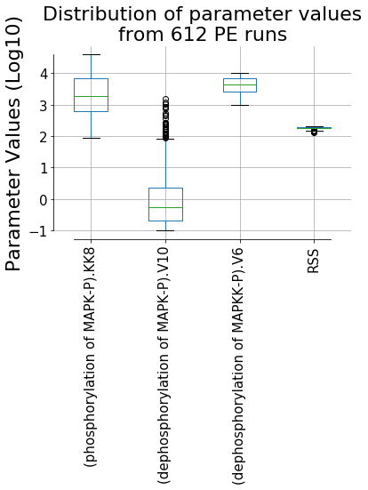


We can also get the top `X` percent. 


```python
PyCoTools.PEAnalysis.PlotBoxplot(K.PE_data_global1,SaveFig='false',NumPerPlot=15,TruncateMode='percent',X=10)
```


    <PyCoTools.PEAnalysis.PlotBoxplot instance at 0x000000000D220588>


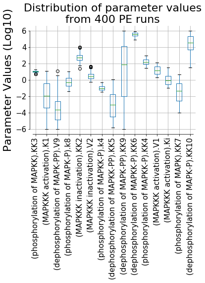


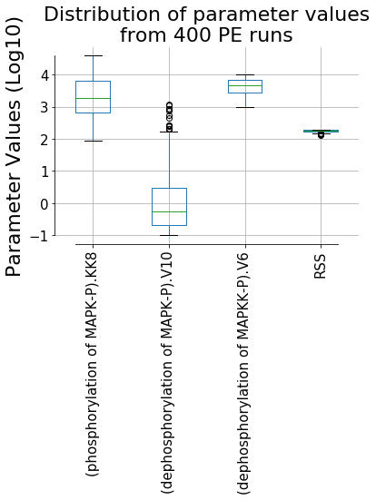


## Histograms


```python
PyCoTools.PEAnalysis.PlotHistogram(K.PE_data_global1,
                                   Log10='true', ##plot on log10 scale
                                   SaveFig='false',Bins=200)
```


    <PyCoTools.PEAnalysis.PlotHistogram instance at 0x000000000D547208>


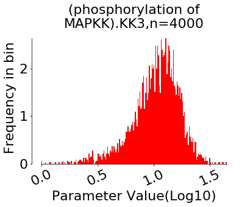


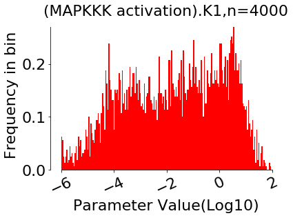


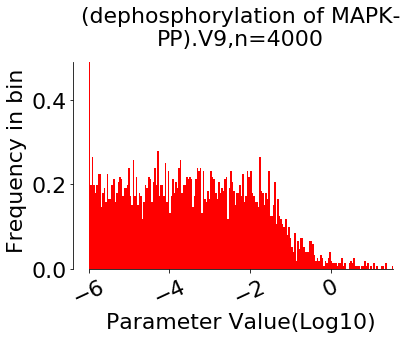


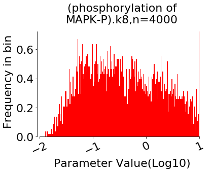


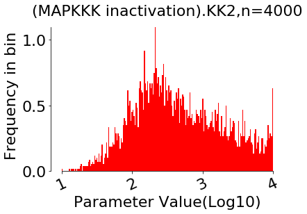


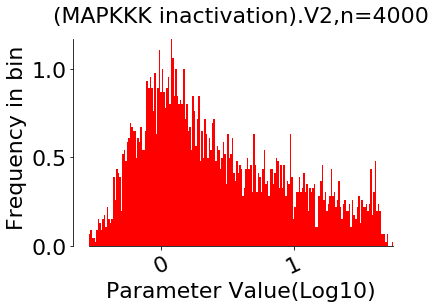


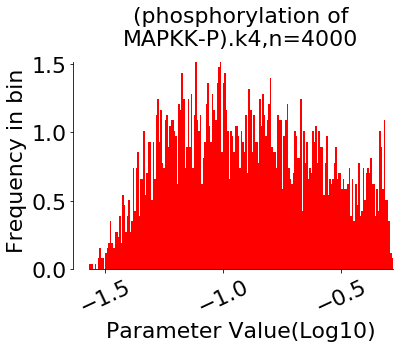


Graphs can also be truncated by top `X` percent:


```python
PyCoTools.PEAnalysis.PlotHistogram(K.PE_data_global1,
                                   Log10='true', 
                                   SaveFig='false',Bins=30,
                                   TruncateMode='percent',X=10) ## Plot top 10% best runs
```


    <PyCoTools.PEAnalysis.PlotHistogram instance at 0x000000000ED68A08>


## Scatter Graphs

The `PlotScatters` class automatically plots all ${{N}\choose{2}}$ pairs of estimated parameters and can therefore take some time with larger models. Since it consumes a lot of memory to plot and show all of these graphs, usually its preferable to write them to file instead. 


```python
PyCoTools.PEAnalysis.PlotScatters(K.PE_data_global1,SaveFig='false',
                                  Log10='true') 
```


    <PyCoTools.PEAnalysis.PlotScatters instance at 0x000000001B20F588>


## Hex Maps

Hex maps are an alternative to both scatter graphs and histograms depending on the `Mode` argument. When `Mode` is `count` (the default), colours represent counts like in a histogram. Because of the dispersion in the data, the `Log10='true'` is usually required to get a good look at the data with scatters and hex maps. Like scatter graphs, all  ${{N}\choose{2}}$ pairs are plotted automatically and therefore its preferable to write them to file instead of viewing in `ipython`. The `GridSize` and `Bins` keywords may need fine tuning by iteration to get decent looking plots. More information can be found [here](http://matplotlib.org/api/pyplot_api.html#matplotlib.pyplot.hexbin)


```python
PyCoTools.PEAnalysis.PlotHexMap(K.PE_data_global1,SaveFig='true',
                                  Show='false',Log10='true')
```


    <PyCoTools.PEAnalysis.PlotHexMap instance at 0x000000000D1240C8>


When `Mode='RSS` hex maps are more like scatter graphs coloured by RSS value. 


```python
PyCoTools.PEAnalysis.PlotHexMap(K.PE_data_global1,SaveFig='true',
                                  Log10='true',Show='false',Mode='RSS')
```


    <PyCoTools.PEAnalysis.PlotHexMap instance at 0x0000000033C94E88>


# `Pydentify2`: Profile Likelihoods

Profile likelihoods are an extremely useful method of assessing a models identifiability status (Raue et al., 2009). This method (along with a number of other useful modelling tools) is impemented in a package called Data2Dynamics (Raue et al., 2015) by the group that first used profile likelihoods in systems biology. COPASI users can also calculate profile likelihoods (Schaber, 2012) though the method is quite tedious. The `Pydentify2` module automates Schabers method while extending it to include calculation of profile likelihoods around multiple and an arbitrary number of parameter sets. A `Plot` class is also provided for easy visualization and calculation of confidence levels. 

Since it can take some time to run a profile likelihood analysis, examples of a pre-run analysis can be downloaded from the [PyCoTools repository](https://github.com/CiaranWelsh/PyCoTools/tree/master/PyCoTools/Examples/KholodenkoExample/ProfileLikelihood) for the Kholodenko2000 model around the top three parameter sets. Alternatively, the following code can be run after all the models in the analysis have finished running (i.e. one for each estimated parameter)

The profile likelihood class can be used in three ways:

## Profile Likelihoods Around Current Point in Parameter Space

Simply use the `ProfileLikelihood` class with the relevant optional arguments. By default `pydentify2` samples 10 times at 1000 fold above and below the parameter of interest. When using `pydentify2` in this way, it is necessary to take note of the `RSS` value for the current parameters and data. This is used later to calculate confidence levels. 


```python
PyCoTools.pydentify2.ProfileLikelihood(K.kholodenko_model,
                                       LowerBoundMultiplier=1000, ## Sample 1000 times above and below the estimated parameter value
                                       UpperBoundMultiplier=1000,
                                       NumberOfSteps=10,
                                       Run='false' #turn this to 'true' before running to run the analysis
                                      )
```


    <PyCoTools.pydentify2.ProfileLikelihood instance at 0x0000000027CB9BC8>


When the analysis has finished running, use the `Plot` class to visualize the results. Remember you'll need the RSS. 


```python
RSS_value=300 ## need to specify this value yourself. (300 is just a made up for illustration)
PyCoTools.pydentify2.Plot(K.kholodenko_model,RSS=RSS_value,SaveFig='true')
```

    Confidence level for Index -1 is 321.941776203 or 2.5077773358 on a Log10 scale
    


    <PyCoTools.pydentify2.Plot instance at 0x000000001581B608>


## Using the `ParameterPath` argument

One of the more useful features of `pydentify2` is the ability to easily calculate profile likelihoods around parameters from a file or folder of files, such as parameter estimation output from COPASI. To do this, use the `ParameterPath` kwarg. 

### Integer Index

Internally, PyCoTools assigs an `Index=-1` when no `ParameterPath` argument is specified. The analysis is set up in a new directory called `<pathToModel>\ProfileLikelihood\-1`. When a parameter estimation results file is specified the `Index` keyword dictates which rank of best fit to calculate profile likelihoods around, i.e. 0 is the best, 1 is second best and so on. 


```python
PyCoTools.pydentify2.ProfileLikelihood(K.kholodenko_model,
                                       ParameterPath=K.PE_data_global1,
                                       Index=0, ## 0 is best fitting (lowest RSS) parameter set
                                       LowerBoundMultiplier=1000, ## Sample 1000 times above and below the estimated parameter value
                                       UpperBoundMultiplier=1000,
                                       NumberOfSteps=25, 
                                       Run='false' #Just set up the profile likelihood
                                      )
```


    <PyCoTools.pydentify2.ProfileLikelihood instance at 0x0000000033FB7EC8>


Now the `RSS` is automatically taken from the parameter estimation data and does not need to be specified by the user. Now the analysis can be found under the `<PathToModel>\ProfileLikelihood\0`. To plot:


```python
PyCoTools.pydentify2.Plot(K.kholodenko_model,ParameterPath=K.PE_data_global1,SaveFig='true',Index=0) 
```

    Confidence level for Index 0 is 141.498776338 or 2.15075268416 on a Log10 scale
    


    <PyCoTools.pydentify2.Plot instance at 0x0000000027CA4808>


Remember to give the `Index` argument to be the same as what was used in `ProfileLikelihood`

### List Index
The `Index` kwarg also takes a list of integers to run profile likelihoods around multiple run parameter sets at once. This is useful because the profile likeihood method of identifiability analysis is a local method, and identifiability status may vary depending on what region of parameter space the parameters are in.  


```python
range_of_indices=range(0,10,2) ##inventive list of indices 
print 'indices used: {}'.format(range_of_indices)
PyCoTools.pydentify2.ProfileLikelihood(K.kholodenko_model,
                                       ParameterPath=K.PE_data_global1,
                                       Index=range_of_indices,
                                       LowerBoundMultiplier=1000, ## Sample 1000 times above and below the estimated parameter value
                                       UpperBoundMultiplier=1000,
                                       NumberOfSteps=25, 
                                       Run='false' #Just set up the profile likelihood
                                      )
```

    indices used: [0, 2, 4, 6, 8]
    


    <PyCoTools.pydentify2.ProfileLikelihood instance at 0x000000003A0AEA08>


To plot:


```python
range_of_indices=range(0,10,2) #Same range used above
PyCoTools.pydentify2.Plot(K.kholodenko_model,
                          ParameterPath=K.PE_data_global1,Index=range_of_indices,MultiPlot='true',
                          SaveFig='true') 
```

    Confidence level for Index 0 is 141.498776338 or 2.15075268416 on a Log10 scale
    Confidence level for Index 8 is 159.902041405 or 2.20385400824 on a Log10 scale
    Confidence level for Index 2 is 152.177585054 or 2.18235068789 on a Log10 scale
    Confidence level for Index 4 is 157.478892969 or 2.19722235316 on a Log10 scale
    Confidence level for Index 6 is 159.297864005 or 2.20220995247 on a Log10 scale
    


    <PyCoTools.pydentify2.Plot instance at 0x00000000218261C8>


When `MultiPlot='true'`, the plotter starts at the largest index and works toward the lowest, sequentially adding profiles from each index to a single canvas per parameter. Graphs in this case can be found the folder of the lowest index. When `MultiPlot='false'`, each parameter index is plotted on their own canvas per `Index`.

## Running Profile Likelihood Calculations

Each way of using `ProfileLikelihood` (referred to as `methods 1-3`) can be run by specifying an argument to the `Run` keyword. There are 4 options:
    1. `Run='false'` -  set up but do not run the profile likelihood analysis
    2. `Run='slow'`  -  set up and run the profile likleihoods in serial, using a single process. 
    3. `Run='multiprocess'` - set up and run profilelikelihoods on separate process in parallel. 
    4. `Run='SGE'` - set up and run on a SunGrid engine based job scheduler. 
    
Using the `multiprocess` mode is not a very sophisticated method of running in parallel. In fact, this isn't true parallel programming since multiple models are simply opened and run by multiple processes. When `Run='multiprocess'`, `ProfileLikelihood` opens a new process for each parameter and attempts to run them at the same time. This can be computationally very heavy and makes a computer unusable until the analysis is finished. 

Note that because the parameters in this iteration of parameter estimations are not particurarly good and therefore after running this example the profiles themselves may look noisy. 

# Running on a Cluster

Sun grid engine users may use the `SGE` mode. This writes a `.sh` script containing commands to submit and run the model via CopasiSE on the cluster. For this reason, people with a SGE cluster but not at Newcastle University will probably have the modify the following snippet of code in the `PyCoTools.pydentify2.ProfileLikelihood().run_SGE` source code to include the directory to COPASI on their own cluster. 

    with open('run_script.sh','w') as f:
        f.write('#!/bin/bash\n#$ -V -cwd\nmodule addapps/COPASI/4.16.104-Linux-64bit\nCopasiSE "{}"'.format(self.cps_dct[i][j]))
                    
People using a job scheduler other than SGE will have to write their own function to submit the analysis. To do this simply copy the `run_SGE` method of the ProfileLikelihood class, change the contents of the `.sh` file and the `os.system` command to whatever is necessary for your own cluster. When using the `ProfileLikelihood` class arguments are checked for validity. Therefore you need to add a `Mode` to the class by modifying the `__init__` section of `ProfileLikelihood` class, specifically the bit which raises an error if the argument passed to `Run` isn't one of `['false','slow','multiprocess','SGE']`:

i.e. change 

    if self.kwargs.get('Run') not in ['false','slow','multiprocess','SGE']:
        raise Errors.InputError('\'Run\' keyword must be one of \'slow\', \'false\',\'multiprocess\', or \'SGE\'')
        
to

    if self.kwargs.get('Run') not in ['false','slow','multiprocess','SGE','other_job_scheduler']:
        raise Errors.InputError('\'Run\' keyword must be one of \'slow\', \'false\',\'multiprocess\', or \'SGE\' or \'other_job_scheduler\' ')

# Scripts

A benefit of using the Python enviornment is that custom and reusable scripts can be easily produced. It is useful to write these scripts so that they are available for use from the command line. The module `argparse` makes it particularly easy to write command line scripts. The following code uses `argparse` to allow a user to pass arguments directly from the command line into the `pycopi.InsertParameters` class which takes parameters from the `ParameterPath` into the `copasi_file`. 


```python
import PyCoTools
import argparse

##==============================================================================
parser=argparse.ArgumentParser(description='Insert Parameters into COPASI file')
parser.add_argument('copasi_file',help='full path to a copasi model corresponding to the parameter estimation data you want to insert')
parser.add_argument('path',help='Path to parameter estimation data file or folder of parameter estimation data files')
parser.add_argument('-i','--Index',type=int,help='Which rank of PE data to insert from path.')
args=parser.parse_args()
#===============================================================================
if args.Index==None:
    args.Index=0
IP=PyCoTools.pycopi.InsertParameters(args.copasi_file,ParameterPath=args.path,Index=args.Index)
print IP.parameters.transpose()
```

This code can be used as a template for any custom analysis. 

# Refernces

* Kholodenko, B.N. (2000) 'Negative feedback and ultrasensitivity can bring about oscillations in the mitogen-activated protein kinase cascades', Eur J Biochem, 267.
* Raue, A., Schilling, M., Bachmann, J., Matteson, A., Schelke, M., Kaschek, D., Hug, S., Kreutz, C., Harms, B.D., Theis, F.J., Klingmüller, U. and Timmer, J. (2013) 'Lessons Learned from Quantitative Dynamical Modeling in Systems Biology', PLoS ONE, 8(9), p. e74335.
* Raue, A., Kreutz, C., Maiwald, T., Bachmann, J., Schilling, M., Klingmüller, U. and Timmer, J. (2009) 'Structural and practical identifiability analysis of partially observed dynamical models by exploiting the profile likelihood', Bioinformatics, 25(15), pp. 1923-1929.
* Schaber, J. (2012) 'Easy parameter identifiability analysis with COPASI', Biosystems, 110(3), pp. 183-185.
* Raue, A., Steiert, B., Schelker, M., Kreutz, C., Maiwald, T., Hass, H., Vanlier, J., Tönsing, C., Adlung, L., Engesser, R., Mader, W., Heinemann, T., Hasenauer, J., Schilling, M., Höfer, T., Klipp, E., Theis, F., Klingmüller, U., Schöberl, B. and Timmer, J. (2015) 'Data2Dynamics: a modeling environment tailored to parameter estimation in dynamical systems', Bioinformatics.

